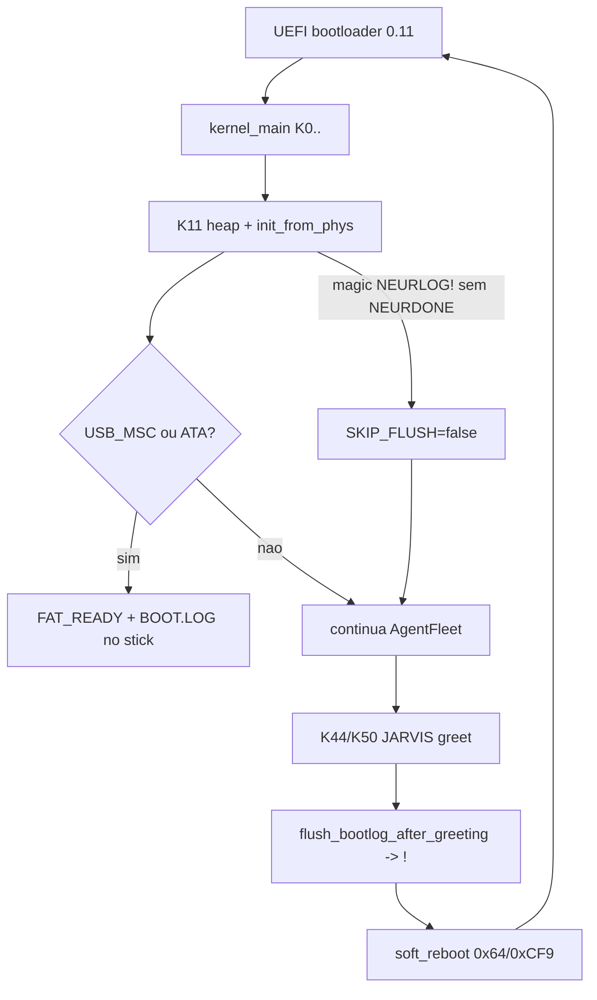

# Fix reboot HW — soft-reboot BOOT.LOG + revisão de boot

## Diagnóstico (evidência de código)

Caminho que reinicia de propósito:

1. [`crates/boot/Cargo.toml`](crates/boot/Cargo.toml) liga **sempre** `features = ["fat-boot-log"]` na imagem de boot.
2. Em HW bare / sem FAT block, [`emit_hw_greeting_at_register`](crates/neural-kernel/src/audio/jarvis.rs) (chamado em [`main.rs` ~L2402](crates/neural-kernel/src/main.rs)) chama `flush_bootlog_after_greeting` → **nunca retorna**.
3. [`flush_bootlog_after_greeting`](crates/neural-kernel/src/boot_logger.rs) conta 12s na tela e chama [`request_flush_and_reboot`](crates/k_nano/src/boot_ramlog.rs) (`out 0x64,0xFE` + `0xCF9`).
4. Magic `NEURLOG!` é escrito em phys `0x1000_0000`. **`NEURDONE` não é escrito em lugar nenhum do repo** (nem vendor bootloader, nem UEFI app).
5. No próximo boot, [`init_from_phys`](crates/k_nano/src/boot_ramlog.rs) só seta `SKIP_FLUSH_REBOOT` se magic == `NEURDONE`. Com `NEURLOG!` sobrando, **não skipa** → JARVIS → soft-reboot de novo = **loop**.

Hipóteses secundárias (só se o sintoma for reboot **antes** de K44/K50 ou sem countdown “BOOT.LOG via UEFI”):

- Triple-fault / #PF early (bootloader BIOS, stack top) — panic handler só `hlt`, não reinicia sozinho.
- Watchdog ACPI do notebook.
- SMP INIT-SIPI agressivo (menos comum no BSP).

**Confirmação visual no HW (1 boot):** se aparecer `>>> BOOT.LOG via UEFI | K… | reboot Ns` ou `>>> soft-reboot gravando BOOT.LOG...`, a causa P0 está confirmada.

## Decisão de produto (fix)

Em HW real o boot deve **continuar até Runtime**, não reiniciar para gravar log. `BOOT.LOG` só via BlockDevice (USB-MSC/ATA) quando disponível; sem MSC: ramlog + FB checkpoints, **sem** `0xCF9`.

## Implementação

### P0 — Matar o loop (obrigatório)

1. **[`boot_logger.rs`](crates/neural-kernel/src/boot_logger.rs)**  
   - Mudar `flush_bootlog_after_greeting` de `-> !` para retorno normal (ou `bool`).  
   - Se `FAT_READY`: flush MSC/ATA e **return** (não halt infinito).  
   - Se sem FAT: append ramlog + mensagem FB clara (`BOOT.LOG indisponivel — continue Runtime`) + `mark_skip_flush_reboot()` + **return** (zero soft-reboot).  
   - Remover chamada a `request_flush_and_reboot` deste path.

2. **[`jarvis.rs`](crates/neural-kernel/src/audio/jarvis.rs)**  
   - `emit_hw_greeting_at_register` / tick path: após greet, chamar o flush **não-fatal**; nunca `-> !`.

3. **[`boot_ramlog.rs`](crates/k_nano/src/boot_ramlog.rs)**  
   - Em `init_from_phys`: se magic == `NEURLOG!` (flush pendente de boot anterior), tratar como tentativa falha/incompleta: setar `SKIP_FLUSH_REBOOT=true`, logar ckpt, **não** re-disparar soft-reboot.  
   - Opcional: escrever `NEURDONE` localmente só como “consumido”, sem depender de UEFI fantasma.  
   - Deixar `request_flush_and_reboot` / `soft_reboot` atrás de `#[cfg]` debug ou documentar como dead/unsafe — default OFF em builds de produto.

4. **Gate de feature**  
   - Manter `fat-boot-log` para escrever via MSC (útil sem COM).  
   - Soft-reboot **não** faz parte do gate de produto; se precisar depois, feature explícita tipo `fat-boot-log-soft-reboot` (default off).

### P1 — BOOT.LOG honesto sem reboot

5. Melhorar persistência quando MSC existe: garantir `init_after_usb` + `flush()` após probe K16 (já parcialmente em main); se MSC ausente, mensagem única no FB com último `boot_ckpt`.  
6. Documentar em SESSION: “reboot loop = soft-reboot BOOT.LOG; não confundir com crash”.

### P2 — Revisão do fluxo boot HW (após P0)

Auditoria por fase (não reescrever Limine agora):

| Fase | Check | Ação se falhar |
|------|--------|----------------|
| Pre-K0 | vendor BltOnly SetMode | já patch SESSION_139 |
| K1–K11 | IDT/mem/heap | ckpt + sem alloc pré-heap |
| K15–K17 | xHCI / USB-MSC | se AUSENTE, **não** reboot; residual MSC |
| K18–K23 | PCI/APIC/SMP | gates honestos; SMP não pode resetar BSP |
| K33–K38 | apps/audio/hub | skip FAT sem MSC (já) |
| K44–K51 | JARVIS | greet + continue (P0) |
| Runtime | TIMER tick | evidência viva |

Instrumentação: garantir `boot_ckpt` + `boot_ramlog::append` em cada gate crítico; foto da tela + `E:\BOOT.LOG` (se MSC) como evidência.

### Fora de escopo deste fix

- Migração Limine (ADR-0062 P4 / #482) — estabiliza boot a médio prazo, não explica o soft-reboot atual.  
- Emagrecedor Wave 7 — paralelo, não bloqueia P0.

## Verificação

1. `cargo clean -p neural-kernel && cargo nk` (0 erros) com feature `fat-boot-log`.  
2. QEMU WHPX: boot completo até TIMER (sem countdown soft-reboot).  
3. HW: rebuild USB (`build_usb_unified.py`), Rufus DD; esperado: passa de K50 e **não** reinicia; orb/Runtime ou pelo menos AgentFleet vivo.  
4. Se ainda reiniciar **antes** de K44: capturar último K na tela / `BOOT.LOG` e abrir trilha secondary (#PF/SMP).

## Arquivos principais

- [`crates/neural-kernel/src/boot_logger.rs`](crates/neural-kernel/src/boot_logger.rs)  
- [`crates/neural-kernel/src/audio/jarvis.rs`](crates/neural-kernel/src/audio/jarvis.rs)  
- [`crates/k_nano/src/boot_ramlog.rs`](crates/k_nano/src/boot_ramlog.rs)  
- [`crates/neural-kernel/src/main.rs`](crates/neural-kernel/src/main.rs) (só se callers precisarem ajuste)  
- [`docs/memory/SESSION_*.md`](docs/memory/SESSION_INDEX.md) (evidência pós-HW)