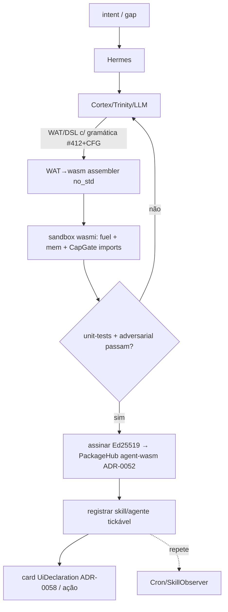

# ADR-0059: Runtime App Factory — WASM real (wasmi) + geração validada de apps por IA

**Data:** 2026-07-21
**Status:** Accepted — **viabilidade CONFIRMADA** (`wasmi` v0.47 **e** `cranelift-codegen` v0.133 compilam `no_std` em `x86_64-unknown-none` soft-float, 0 erros). **Caminho A (wasmi) IMPLEMENTADO e validado** (QEMU: `.wasm` real `add(2,3)=5` PASS; seletor A/B/C PASS). **F7 (arena W^X) IMPLEMENTADO** (execução nativa on-device: `mov eax,42;ret`→42 PASS — base do JIT). Caminhos B/C: backend Cranelift presente (feature `jit-cranelift`), **execução nativa GATED** por **F6 (ring Ring3, BLOQUEADOR)** + HITL forte.
**Lifecycle (INDEX):** `fazendo`
**Depreca / supersede:**
- **ADR-0031** (Self-Update/WASM/JARVIS): reverte o desvio "wasmi → VM `Op` custom"; runtime real passa a ser **wasmi**. Self-update/JARVIS permanecem (não são tema desta ADR).
- **ADR-0032** (WASM Agent Apps): a visão (`.wasm` = agente, syscalls = skills) é **absorvida e concretizada** aqui; o interpretador parcial `wasm.rs` e a VM `Op` são aposentados.
**Estende:** ADR-0051 (PackageHub), ADR-0052 (contrato de artefato + `agent-wasm`), ADR-0053 (marketplace/trust), ADR-0041 (CapGate host-imports), ADR-0057 §WS-G #412 (structured decoding → gramática), ADR-0058 (retorno visual = card), ADR-0044 (patterns Python/SSA — pesquisa).
**IDEA_BANK:** deprecar/reapontar #103/#309a (wasmi "custom"), #385–396 (host ABI/WASI), #402 (memory pool), #411 (SkillOpt), #8/#11 (WASM UI/USB), #306 (wasmi bridge); novas #469.

---

## 1. Contexto e problema (gap real — SESSION_163 audit)

Hoje o OS **roteia** intents (Hermes→Trinity→skill/LLM), **gera texto** (RustCoder/SKILL.md) e roda uma **VM de bytecode próprio** (`wasm_exec::Op`, keyword-gerada) mislabeled como "WASM". Ele **não executa módulos WASM padrão, não compila código gerado, e os bridges para tornar uma geração em app executável não existem**:

- **`wasmi` ausente**; "WASM" = `Op` VM + `wasm.rs` (subset parcial de opcodes). ADR-0031 admite o desvio.
- **RustCoder gera texto**; nenhum caminho compila/carrega (`cortex.rs:2172`; `cognitive_bridge` manda `rust_coder→None`).
- **`DynamicSkill.execute` é stub** (`dynskill.rs:44`); **SKILL.md auto-gerado não vira executável**; **`PackageKind::AgentWasm` é só catálogo** (nenhum spawn em `agent-core`).
- **MicroPython** = scaffolding (`eval()` passa hash); **RustPython** confirmado **não-`no_std`** (descartado).
- **Sem `rustc`/LLVM no kernel** → compilar Rust on-device é inviável em bare-metal.

Estado da arte (2026) converge: **gerar → validar em sandbox WASM/WASI (unit-tests + adversarial + fuel) → promover a uma _tool library_ persistente e versionada** (arXiv SelfEvolve 2604.16314, ARISE/EvolveTool-Bench 2604.00392, Tool-Making 2607.08010, MCP-SandboxScan 2601.01241; framework AAGT). Gramática restrita (GBNF/Outlines/XGrammar) garante **sintaxe válida** do código gerado.

## 2A. Os 3 caminhos (IA recomenda, usuário/HITL decide) — a critério do usuário

`hermes::app_factory::analyze_and_recommend` faz a IA **analisar o pedido e recomendar** um backend; o **usuário/HITL decide**; `execute()` aplica **CapGate + HW-gate (ring de isolamento) + HITL**.

| Caminho | IA emite | Backend | Isolamento | Status |
|---|---|---|---|---|
| **A `WasmInterp`** | WAT/DSL→wasm | `wasmi` (interpretador) | ✅ sandbox SFI + fuel + CapGate (default p/ código de IA não-confiável) | **✅ implementado** (self-test `add`) |
| **B `WasmJit`** | WAT/DSL→wasm | Cranelift wasm→nativo | mantém semântica wasm; **código nativo → exige ring** | 🟡 backend compila (feature); exec **gated** (ring+HITL) |
| **C `NativeRustSubset`** | Rust (subset) | Cranelift (à la `rustc-lite`) | **sem sandbox wasm → exige ring + HITL forte** | 🟡 backend compila; exec **gated**; trilha self-hosting |

Política (honesta): não-confiável→**A**; confiável+perf→**B** (HITL+ring); Rust/self-hosting→**C** (HITL forte+ring). Enquanto o **ring de isolamento** (ADR-0041 Ring3/AS) não existe, B/C retornam `VERDICT=AWAITING_ISOLATION` (não executam nativo — segurança primeiro).

## 2B. Integração self-heal / self-update / self-improve

A App Factory é o motor de execução do ciclo evolutivo (Sprint 108 + ADR-0047):
- **self-improve:** `self_evolve`/`SkillOpt` geram skill → **testada no sandbox wasmi (A)** → promovida assinada (ADR-0052) → tickável. Cron amortiza (tool library).
- **self-heal:** `SelfHealAgent` detecta gap (firmware/skill ausente) → App Factory gera/roda a correção em sandbox → aplica sob CapGate/HITL.
- **self-update:** módulos WASM assinados atualizados a quente (`evolve::hot_swap`) no runtime wasmi, sem reboot; update nativo (C) só via ring+HITL.

## 2. Decisão

**Runtime App Factory:** o AIOS executa apps/skills como **módulos WASM reais no `wasmi`** (`no_std`, fuel, Apache-2.0), e **fabrica apps por IA em runtime** pelo ciclo:

```
Hermes detecta gap/intent  →  Cortex/Trinity/LLM GERAM artefato
   (WAT ou DSL, sob decodificação restrita por gramática — evolução do #412)
→  assembler WAT→wasm (no_std)  →  TESTE em sandbox wasmi
   (unit-tests auto-gerados + adversarial + fuel/mem limit + CapGate deny)
→  se PASSA: assinar (Ed25519) → PackageHub `agent-wasm` (ADR-0052)
   → registrar como skill/agente tickável → (opcional) card de retorno (ADR-0058)
→  Cron/SkillObserver repetem (tool library amortizada — SkillOpt cravado)
```

**Princípio bare-metal:** como não há `rustc` on-device, a IA emite **WAT/DSL** (assemblável em no_std), **não Rust compilado**. Rust→wasm fica para build host/sidecar (fora do bare-metal) = residual.



## 3. Plano de implementação (fases; cada uma compila 0-erros + boota + testável)

### F1 — Runtime wasmi real (fundação)
- Adicionar `wasmi` (`no_std`, sem `std`/WASI-default) a `crates/hermes` (e re-export p/ `skill-registry`). **Validar 1º que compila em `x86_64-unknown-none` soft-float** (risco: ver §5).
- `WasmiRuntime`: `Engine` (config fuel on) + `Store<HostCtx>` + `Module::new` + `Linker` (host imports) + `Instance`. Executa `fn` exportada com `set_fuel`.
- Coexistir com a `Op` VM atrás de feature; migrar `wasm_rt::execute` para wasmi; **aposentar `wasm_exec::Op` e `wasm.rs`** ao fim.
- **Aceite:** carregar um `.wasm` conhecido (ex.: `add(i32,i32)`) do VFS/FAT e retornar resultado correto; self-test de boot `[WASMI] self-test PASS`.

### F2 — Host ABI + CapGate (sandbox)
- Namespace de imports `aios::*` no `Linker`, cada um gated por `capability_gate::check`: `log`, `ui_spec` (publica card ADR-0058), `net_get` (SEND_TCP), `fs_read`, `kv_get/put`, `time`. **MMIO negado**; sem WASI de disco por default.
- Limites por instância: **fuel** (timeout determinístico) + **memory.max pages** + trap→deny log. WASI subset opcional via `wasmi_wasi` (gated).
- **Aceite:** módulo que chama `aios::log`/`aios::ui_spec` roda; módulo sem Cap para `net_get` é **negado** (log `VERDICT=DENY`).

### F3 — Bridges (fechar o que falta)
- `skill_registry::register_wasm_skill(name, bytes)` → `WasmSkill::execute` chama wasmi (substitui o `wasm.rs` parcial).
- `DynamicSkill` guarda bytes wasm opcionais → `execute` chama wasmi (remove o stub echo).
- `PackageKind::AgentWasm` → `agent-core` **spawna `AgentInstance`** que dá `tick()` no módulo (export `tick`), sob schedule/Trust.
- SKILL.md/LLM: se a geração produzir wasm/WAT válido, montar + registrar (senão, segue prompt/catálogo).
- **Aceite:** `/learn` com um WAT simples → skill **executa de verdade**; `agent-wasm` do PackageHub aparece no fleet e ticka.

### F4 — Geração validada por IA (o coração)
- **Gramática:** evoluir `cortex::decode` (#412) de allow-mask por token para um **CFG/PDA (GBNF-like) no_std** que restringe a saída a **WAT** (ou uma DSL de skills) sintaticamente válida. (Refs: llama.cpp GBNF, Outlines, XGrammar.)
- **Assembler WAT→wasm** leve em `no_std` (subset: funcs, locals, i32/i64/f32/f64 básicos, chamadas de import, memória) — evita depender de `rustc`.
- **Harness de teste em sandbox:** Cortex/LLM também gera casos (entrada→saída esperada); rodar no wasmi com fuel + adversarial; `LLM-as-judge`/asserts. Só promove no PASS (padrão ARISE/SelfEvolve).
- **Aceite:** dado um pedido ("skill que soma dois números"), o LLM emite WAT válido (gramática), monta, passa nos testes no sandbox e vira skill executável — **sem intervenção**.

### F5 — Promover / persistir (ADR-0052 + PackageHub + SkillOpt)
- Módulo aprovado → assinar (sessão Ed25519) → artefato `agent-wasm` schema 1 (ADR-0052) em `ecosystem/agents/` (NeuralFS) → registrar tickável. HITL para não-boot tokens.
- **SkillOpt cravado:** efêmero→wasm real (não mais `Op`); `RustNoStd` marcado residual (precisa host build).
- Cron/SkillObserver re-disparam (tool library amortizada, arXiv Tool-Making).
- **Aceite:** app gerada persiste assinada, sobrevive reboot (FAT/NeuralFS), e é reexecutada por Cron.

### F6 — Python (opcional) e retorno visual
- Python como `.wasm` (MicroPython/quickpython compilado, off-device) rodando **dentro do wasmi** — não RustPython. Ou tratar Python como fonte convertida a WAT/DSL.
- Retorno: skill emite `UiDeclaration` (ADR-0058) → card, fechando "Hermes pede → … → retorna a solução" visualmente.

## 4. Deprecações / marcações

| Item | Ação |
|---|---|
| ADR-0031 | Superseded (parcial): desvio "wasmi→Op VM" **revertido**; runtime = wasmi. Self-update/JARVIS mantidos. |
| ADR-0032 | Superseded: visão absorvida; `Op` VM + `wasm.rs` aposentados por wasmi. |
| IDEA #103/#309a | ✅→🔄 reapontar: runtime = **wasmi** (não VM custom). |
| IDEA #385–396, #402 | host ABI/WASI/memory → **CapGate + wasmi Linker** (ADR-0059). |
| IDEA #411 (SkillOpt) | cravar em wasm real (F5). |
| IDEA #8/#11/#306 | WASM UI/USB/bridge → via wasmi + host imports. |

## 5. Riscos e mitigação

- **wasmi compila em `x86_64-unknown-none` soft-float?** Risco alto/decisivo — validar **na F1 antes de tudo**; se puxar dep incompatível ou exigir hardfloat, avaliar `features`/patch ou fallback (manter `Op` VM + interpretar subset). Nota: wasmi executa f32/f64 do wasm via Rust f32/f64 → sob `-sse` o compilador usa soft-float (deve funcionar; confirmar).
- **Assembler WAT→wasm no_std:** escopo controlado (subset), não WAT completo.
- **Gramática CFG no_std:** implementar um PDA mínimo (não a GBNF inteira); começar com DSL restrita antes de WAT livre.
- **Segurança:** CapGate nega MMIO/DMA; fuel + mem cap evitam loop infinito/OOM (MCP-SandboxScan pattern). Sem `unsafe` host além do necessário.
- **Sem `rustc`:** Rust→wasm on-device = **fora de escopo** (residual host/sidecar).

## 6. Critérios de aceite (gate da ADR)

- [x] **F1: wasmi roda `.wasm` real (`add(2,3)=5`) no bare-metal; self-test PASS; `cargo check` 0 erros.** (`hermes::wasmi_rt`)
- [x] **Seletor A/B/C (IA recomenda, HITL decide) + CapGate/HW-gate; self-test PASS.** (`hermes::app_factory`)
- [x] **Viabilidade B/C: `cranelift-codegen` no_std compila (feature `jit-cranelift`).**
- [~] F2: host ABI `aios::log` gated instalado; fuel ✅. (mem-max/mais imports = follow-up)
- [ ] F3: bridge `register_wasm_skill`/`DynamicSkill`/`agent-wasm`→wasmi (runtime pronto; bridge = próxima fase).
- [ ] F4: gramática CFG (#412→PDA) + assembler WAT→wasm + harness de teste.
- [ ] F5: promover assinado (ADR-0052) + Cron.
- [x] **F7 (W^X exec arena):** `exec_arena` executa **código nativo gerado on-device** (self-test `mov eax,42;ret`→42 PASS). Base do JIT Cranelift. **É Ring 0 (não isolado)** — só para código próprio/confiável até o Ring3.
- [ ] **F6 (Ring3 isolamento):** **BLOQUEADOR** — `iretq` real (`TRY_ENTER_RING3`) dá `#PF err=0x10` (supervisor instruction-fetch, not-present) logo após `mov cr3`: hipótese = **kernel text não confiável no clone raso** ao trocar de CR3 (ou storm no `fault_abort`). Habilitar arrisca **travar o boot** (storm→ABORTING→hlt). Decisão: **não habilitar** neste turno para não desestabilizar o boot; requer sessão de **debug dedicada** (reproduzir + instrumentar o clone/CR3/IST). Enquanto não passar, `isolation_ring_available()=false` → **B/C nativo permanece gated (segurança)**.
- [ ] aposentar `Op` VM + `wasm.rs` após bridges migrarem para wasmi.
- [x] boot QEMU sem panic; evidência em log (`[WASMI]`/`[APPFACTORY]`/`[EXEC-ARENA]` PASS).

### Nota F6/F7 (isolamento — honesto)
`isolation_ring_available()` só vira `true` quando **F6 (Ring3)** estiver validado
(rodar blob nativo em CPL=3, syscall gated, faltas contidas — "mata sandbox, não
kernel"). O **exec arena (F7)** entrega a *codegen/execução nativa*; a *isolação*
depende do Ring3. Rodar código de IA **não-confiável** em nativo sem Ring3 seria
código com privilégio de kernel — por isso permanece **gated + HITL** (exatamente
a premissa de isolamento forte pedida). Próximo passo real: sessão debug do Ring3
(clone CR3 mapeando kernel text corretamente + IST + fault-abort sem storm).

## 7. Referências

- Código atual: `crates/hermes/src/{wasm_rt,wasm_exec,wasm,micropython_wasm,skill_opt,self_evolve,evolve,package_hub,capability... }`, `crates/skill-registry/src/*`, `crates/cortex/src/{decode,trinity}.rs`, `crates/neural-kernel/src/{agents,cortex}.rs`.
- Crates: [wasmi](https://github.com/wasmi-labs/wasmi) (Apache-2.0, no_std, fuel, WASI), wasm3/WAMR (C, alternativas), quickpython/MicroPython (Python→wasm).
- Gramática: llama.cpp GBNF, Outlines, XGrammar, llguidance.
- arXiv: SelfEvolve (2604.16314), ARISE/EvolveTool-Bench (2604.00392), Tool-Making Self-Evolving Agents (2607.08010), MCP-SandboxScan (2601.01241); framework AAGT (WASM ForgeSkill + políticas).
- Projeto: ADR-0031/0032/0041/0044/0051/0052/0053/0057/0058.
