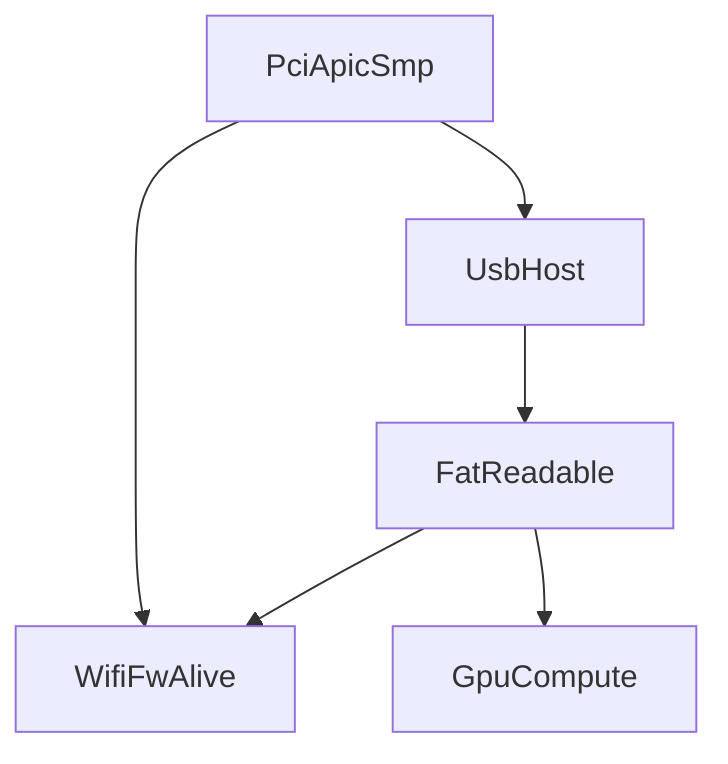

# UnlockDAG — degraus e tokens

## UnlockStage

`Locked | NeedsFw | BringingUp | Partial | Ready | Failed | Quarantined`

Cada nó: `requires: [CapToken…]` / `provides: [CapToken…]`.

## Grafo interno

## NVIDIA (padrão)

D0 BAR → D1 FW → D2 ACR (`GpuAcrBooted` ≠ compute) → D3 channel → D4 runlist → D5 canário (`GpuCompute`). Display paralelo (`GpuDisplay`).

## USB xHCI

U0 reset → U1 sched → U2 port/speed → U3 EP0 → U4 class (HID/MSC/UAC/BT/CDC).

## Bluetooth

Ausente no código; path A combo WiFi, path B dongle pós-`UsbEp0`. `DeviceClass::Bluetooth`.

## Regras

DAG acíclico; timeouts; Partial honesto; tags docs `depends_on:` mapeiam aos mesmos tokens.
